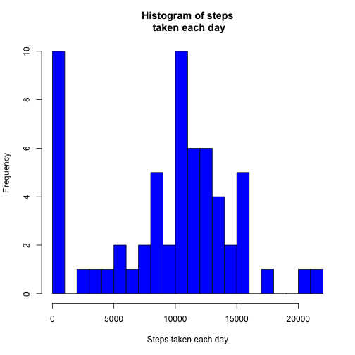

## Loading and preprocessing the data


```r
df <- read.csv("activity.csv",header= T)
```

## What is mean total number of steps taken per day?

The total number of steps taken in these dates are:

```r
tmp <- aggregate(df$steps, by = list(date = df$date), FUN= "sum", na.rm = T)
names(tmp) <- c("date", "total.steps")
tmp
```

```
##          date total.steps
## 1  2012-10-01           0
## 2  2012-10-02         126
## 3  2012-10-03       11352
## 4  2012-10-04       12116
## 5  2012-10-05       13294
## 6  2012-10-06       15420
## 7  2012-10-07       11015
## 8  2012-10-08           0
## 9  2012-10-09       12811
## 10 2012-10-10        9900
## 11 2012-10-11       10304
## 12 2012-10-12       17382
## 13 2012-10-13       12426
## 14 2012-10-14       15098
## 15 2012-10-15       10139
## 16 2012-10-16       15084
## 17 2012-10-17       13452
## 18 2012-10-18       10056
## 19 2012-10-19       11829
## 20 2012-10-20       10395
## 21 2012-10-21        8821
## 22 2012-10-22       13460
## 23 2012-10-23        8918
## 24 2012-10-24        8355
## 25 2012-10-25        2492
## 26 2012-10-26        6778
## 27 2012-10-27       10119
## 28 2012-10-28       11458
## 29 2012-10-29        5018
## 30 2012-10-30        9819
## 31 2012-10-31       15414
## 32 2012-11-01           0
## 33 2012-11-02       10600
## 34 2012-11-03       10571
## 35 2012-11-04           0
## 36 2012-11-05       10439
## 37 2012-11-06        8334
## 38 2012-11-07       12883
## 39 2012-11-08        3219
## 40 2012-11-09           0
## 41 2012-11-10           0
## 42 2012-11-11       12608
## 43 2012-11-12       10765
## 44 2012-11-13        7336
## 45 2012-11-14           0
## 46 2012-11-15          41
## 47 2012-11-16        5441
## 48 2012-11-17       14339
## 49 2012-11-18       15110
## 50 2012-11-19        8841
## 51 2012-11-20        4472
## 52 2012-11-21       12787
## 53 2012-11-22       20427
## 54 2012-11-23       21194
## 55 2012-11-24       14478
## 56 2012-11-25       11834
## 57 2012-11-26       11162
## 58 2012-11-27       13646
## 59 2012-11-28       10183
## 60 2012-11-29        7047
## 61 2012-11-30           0
```


Below is the histogram of stpes taken each day.

```r
hist(tmp$total.steps, xlab = "Steps taken each day", main = "Histogram of steps\n taken each day", breaks = 20, col = "blue")
```

 


```r
mean.steps.day <- round(mean(tmp$total.steps),0)
median.steps.day <- round(median(tmp$total.steps),0)
```

The mean total number of steps taken per day is 9354. The median total number of steps take per day is 10395.

## What is the average daily activity pattern?
 

The 5-minute interval, on average across all the days in the dataset, contains the maximum number of steps is 104.

## Imputing missing values

```r
n.missing <- nrow(df[which(is.na(df$steps)),])
```

There are 2304 missing values in the dataset. To fill in all of the missing steps, we used mean for that 5-minute interval.


```r
## create a new dataset called "df_new" with all the missing values filled in
df_new <- merge(df, tmp2, by = "interval")
df_new$steps <- ifelse(is.na(df_new$steps.x), df_new$steps.y, df_new$steps.x)
df_new <- subset(df_new, select = c(-2,-4))
df_new <- df_new[order(df_new$date),]

## histogram of the total number of steps taken each day
tmp3 <- aggregate(df_new$steps, by = list(date = df_new$date), FUN= "sum")
names(tmp3) <- c("date", "total.steps")
hist(tmp3$total.steps, xlab = "Steps taken each day", main = "Histogram of steps\n taken per day w/ filling missings", breaks = 20, col = "blue")
```

 

```r
mean.steps.day1 <- round(mean(tmp3$total.steps),0)
median.steps.day1 <- round(median(tmp3$total.steps),0)
```

After filling in the missing values, the mean total number of steps taken per day is 10766. The median total number of steps take per day is 10766.

The mean steps per day increased from 9354 with missings to 10766 after filling in the missings. The median steps per day is also different before and after filling in the missings, but the differnce is smaller comparing to the change in the mean. So median is more robust than mean for imputing missing values.

By comparing the histograms of before and after filling in the missings (there are less 0s in the second histogram), the total daily steps are more reasonable after filling in the missings. 


## Are there differences in activity patterns between weekdays and weekends?


```r
## Create a new factor variable in the dataset with two levels – “weekday” and “weekend”
df_new$day <- ifelse(weekdays(as.Date(df_new$date)) %in% c("Saturday","Sunday"), "weekend","weekday")
df_new$day <- as.factor(df_new$day)
```


```r
library(lattice)
tmp4 <- aggregate(df_new$steps, by = list(df_new$interval,df_new$day), FUN= "mean")
names(tmp4) <- c("interval","day","steps")
xyplot(steps~interval|day, data=tmp4, type = "l",layout = c(1,2),ylab = "Mean number of steps")
```

 
